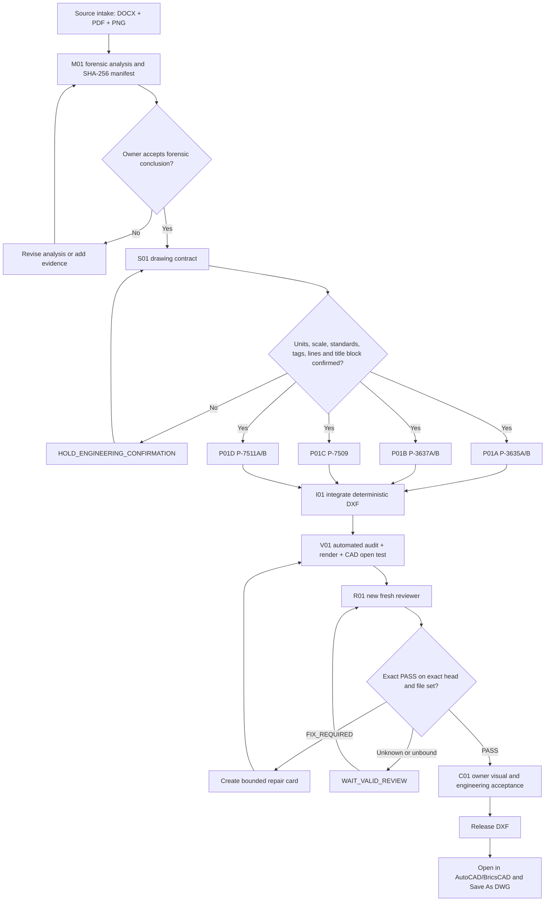
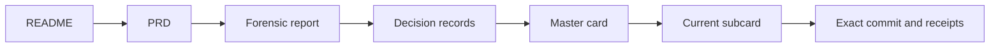

# Workflow Diagrams

## Delivery flow



## Authority and receipt flow

```mermaid
sequenceDiagram
    participant C as Owner / Control
    participant G as GitHub durable record
    participant W as Worker
    participant R as Fresh Reviewer

    C->>G: Publish exact card and accepted base
    G->>W: Worker reads card and base
    W->>G: READY receipt with head, files and tests
    Note over C,G: Dispatch or link alone is not pickup or PASS
    G->>R: Review exact head and file set in a new context
    R->>G: PASS or FIX_REQUIRED with evidence
    alt Exact PASS
        G->>C: Control reads back verdict and advances
    else FIX_REQUIRED or unknown
        G->>C: Hold; create bounded repair or request valid review
    end
```

## Handoff reading order


